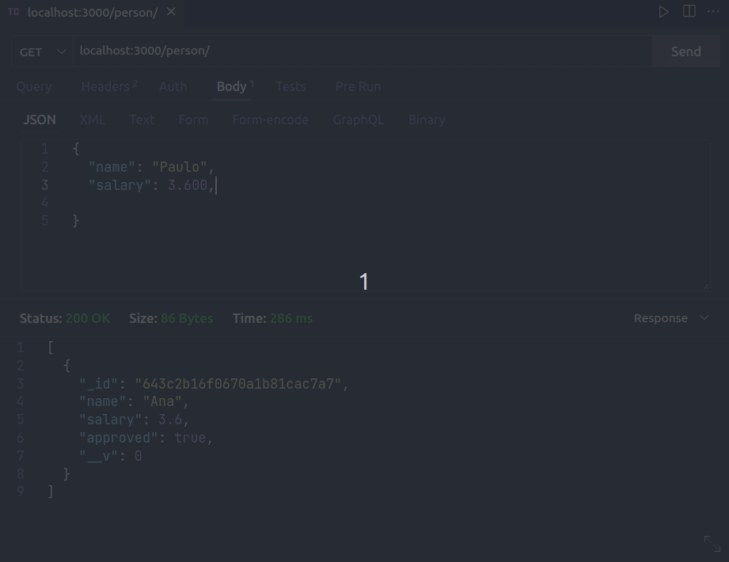

#  Projeto API restful

Neste projeto foi desenvolvido uma API de pessoas com as informações de Nome, Idade, Salário e se o usuário foi aprovado ou não.
Para testar a API com o CRUD - Create, Read, Update e Delete -  você pode utilizar o Thunder Client, uma extensão do VS Code.
Após inserir os dados do cliente os dados ficarão salvos na API com o endpoint *'/person'*.

**Veja uma demonstração abaixo:**

<p align="center">
  
 </p>

## 🚀 Começando

Para que você consiga acessar o projeto, siga as instruções abaixo:

- [ ] Faça um clone do projeto em sua máquina utilizando o código SSH;

- [ ] Entre na pasta raiz do projeto e no terminal rode o comando abaixo para que todas as dependências do projeto sejam instaladas;

```bash
npm install
```

- [ ] Para ter acesso a API criada nesse projeto no terminal rode o comando abaixo. 
O localhost:3000 ficará disponível, com os endpoints '/person';

```bash
npm start
```

## 🛠️ Como esse projeto foi desenvolvido?

**Tecnologias utilizadas:**
<br>

&nbsp;


**BACK-END**
<br>

&nbsp;
- MongoDB Atlas - salva o DB em Cloud
- Thunder Client: utilizado para testar a API

**DEPENDÊNCIAS INSTALADAS:**
<br>

&nbsp;

- Express 
- Mongoose

## :pushpin:  Referências utilizadas:

**[Como criar uma API Rest com NodeJs e MongoDB](https://www.youtube.com/watch?v=K5QaTfE5ylk)** 

